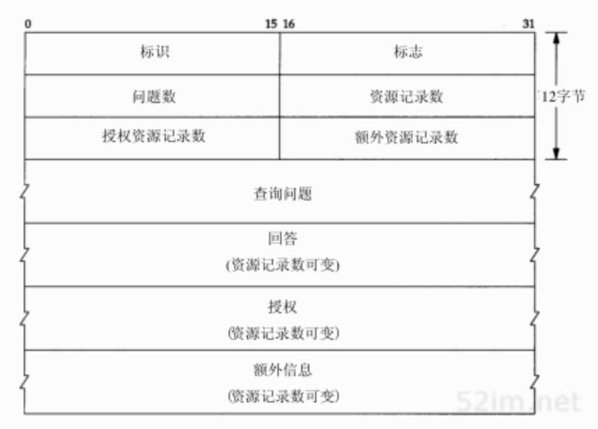
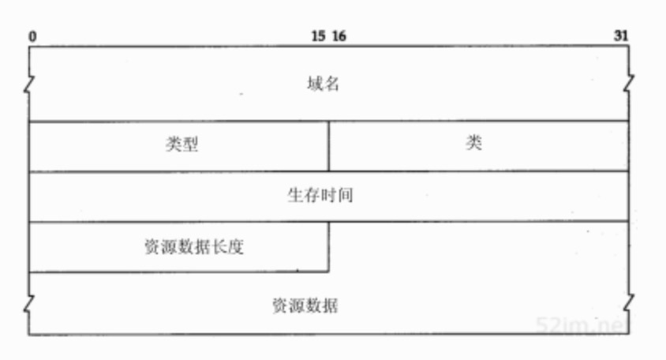
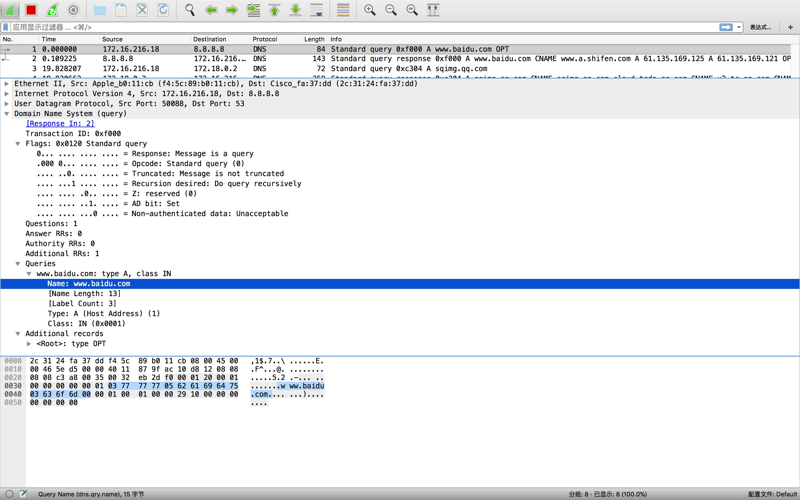
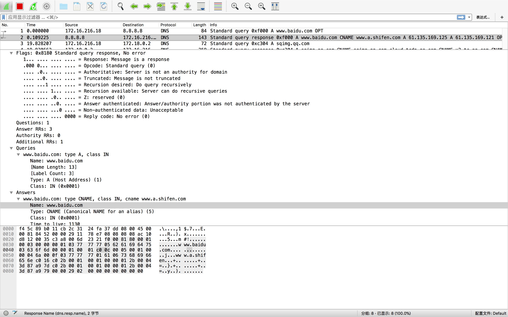

### DNS 协议


#### 头信息
DNS协议头共12字节，分六大部分。
- 第一部分2字节(16位)为`Transaction Id`，用来标识唯一的查询请求（主要应为UDP协议）。
- 第二部分2字节为标志位`Flags`，共16位(bit)。
    - QR(Request/response)是1位（bit）字段：0表示查询报文，1表示响应报文。
    - opcode 是一个4位字段：通常值为0（标准查询），其他值为1（反向查询）和2（服务器状态请求）。
    - AA(Authoritative answer)是1bit标志，表示“授权回答(authoritative answer)”。该名字服务器是授权于该域的。
    - TC(Truncation)是1bit字段，表示“可截断的(truncated)”。使用UDP时，它表示当应答的总长度超过512字节时，只返回前512个字节。为1时客户端会重新发起一个TCP DNS查询请求。
    - RD(Recursion desired)是1bit字段表示“期望递归（recursion desired）”。该比特能在一个查询中设置，并在响应中返回。
    - RA(Recursion available)是1bit字段，表示“可用递归”。如果名字服务器支持递归查询，则在响应中将该比特设置为1。
    - Reserved 随后的3bit字段必须为0。
    - rcode(Return code)是一个4bit的返回码字段。通常的值为0（没有差错）和3（名字差错）。
- 第三部分2字节`Question Resource Record count`(请求和响应)。
- 第四部分2字节`Answer Resource Record count`(响应)。
- 第五部分2字节`Authority Resource Record count`。
- 第六部分2字节`Additional Resource Record count`。

#### Question Resource Record


查询问题是一个可变长度的，主要是因为域名长度不固定。`Question Resource Record count`的数量代表查询问题的数量。查询问题分三部分，一个可变长度的域名，一个2自己的查询类型，一个字节的查询类。
- 查询域名结构为长度子域名值
    ```
    # www.baidu.com 分三部分。第一部分www长度为3，第二部分baidu长度为5，第三部分www长度为3。最后以为0表示结束。
    3www5baidu3com0
    ```
- 查询类型2字节，主要有`A`、`MX`、`CNAME`等。
- 查询类2字节互联网应用都为1。

#### Answer Resource Record、Authority Resource Record、Additional Resource Record
  

这三部分结构类似，简称`Resource Record (RR)`，共六大部分。
- 第一部分为可变长度的域名。域名部分和查询部分域数据格式一样`长度-域名值`，不同的一点是此处域名可以压缩。如果第一个长度位前2字节为`11`表示后面的数据不再是数据长度，而是一个引用地址。引用地址为域名部分前2位（16字节）中除去前2位`11`剩下的14个位，它的的十进制数表示偏移位（一般为`c0 0c`，因为DNS报文12字节固定头，后面紧跟着就是查询问题的域名部分。12的二进制形式为`00001100`，完整的二进制位`11000000 00001100`，十六进制形式即为`c0 0c`）。    
- 第二三部分查询域名、查询类，各2字节。同`Question Resource Record`记录格式。
- 第四部分生存时间(Time-to-Live ttl)共4字节(32bit)形式。
- 第五部分2字节表示剩下部分的数据长度。
- 第六部分为数据，不同的Resource Record区别主要在第六部分数据。

> 通过Wireshark抓取的网络包
 

### 查看
1. dig
    ```
    dig @114.114.114.114 www.baidu.com A
    ```
2. nslookup 
    ```
    nslookup www.baidu.com
    ```

### 清理
1. Mac
    ```
    lookupd -flushcache 这个命令适用于Tiger或更低版本 Mac OS
    dscacheutil -flushcache 这个适用于Mac OS Leopard 
    ```
2. Linux 
    ```
    service nscd reload
    ```
3. Windows 
    ```
    ipconfig /flushdns
    ```
4. Chrome 
    ```
    chrome://net-internals/#dns
    chrome://net-internals/#sockets
    ```

### 参考
- [如何在 Linux/Unix/Mac 下清除 DNS 查询缓存](https://linux.cn/article-3341-1.html)
- [dig](dig.md)