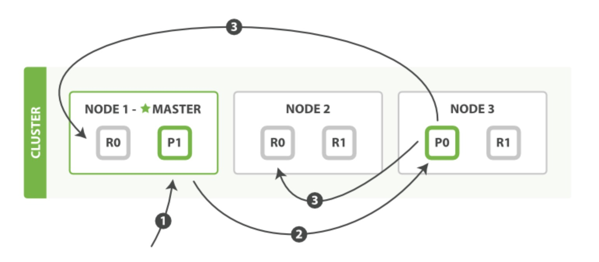
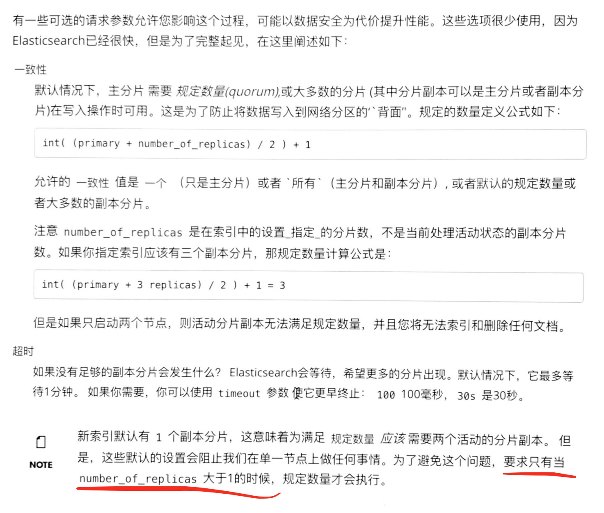
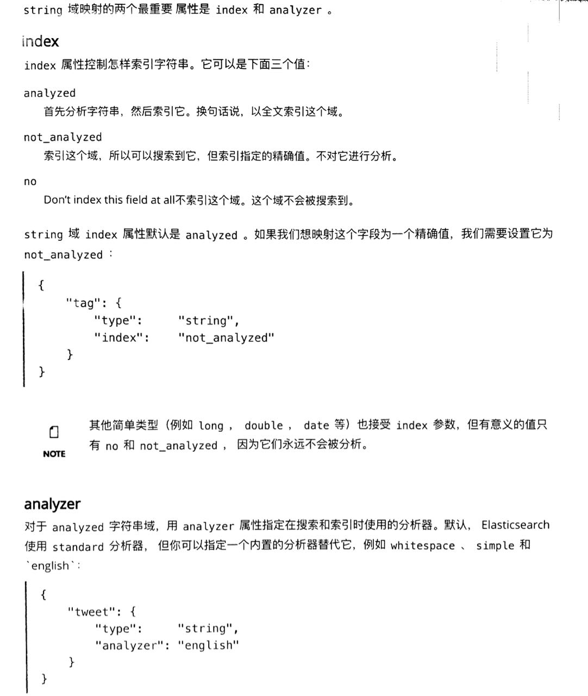

### Java API 客户端
- 节点客户端（Node client）    
节点客户端作为一个非数据节点加入到本地集群中。换句话说，它本身不保存任何数据，但是它知道数据在集群中的哪个节点中，并且可以把请求转发到正确的节点。
- 传输客户端（Transport client）    
轻量级的传输客户端可以可以将请求发送到远程集群。它本身不加入集群，但是它可以将请求转发到集群中的一个节点上。


### 面向文档
也许有一天你想把这些对象存储在数据库中。使用关系型数据库的行和列存储，这相当于是把一个表现力丰富的对象挤压到一个非常大的电子表格中：你必须将这个对象扁平化来适应表结构--通常一个字段>对应一列--而且又不得不在每次查询时重新构造对象。

Elasticsearch 是 面向文档 的，意味着它存储整个对象或 文档_。Elasticsearch 不仅存储文档，而且 _索引 每个文档的内容使之可以被检索。在 Elasticsearch 中，你 对文档进行索引、检索、排序和过滤--而不是对行列数据。


### 简单命令 
- 将 HTTP 命令由 PUT 改为 GET 可以用来检索文档，同样的，可以使用 DELETE 命令来删除文档，以及使用 HEAD 指令来检查文档是否存在。如果想更新已存在的文档，只需再次 PUT 。


### 常用接口
1. 创建mapping


###  集群内的原理
一个运行中的 Elasticsearch 实例称为一个 节点，而集群是由一个或者多个拥有相同 cluster.name 配置的节点组成，**它们共同承担数据和负载的压力**。当有节点加入集群中或者从集群中移除节点时，**集群将会重新平均分布所有的数据**。

当一个节点被选举成为主节点时，**它将负责管理集群范围内的所有变更**，例如增加、删除索引，或者增加、删除节点等。而主节点并不需要涉及到文档级别的变更和搜索等操作。

**我们可以将请求发送到集群中的任何节点**，包括主节点。**每个节点都知道任意文档所处的位置**，并且能够将我们的请求直接转发到存储我们所需文档的节点。无论我们将请求发送到哪个节点，它都能负责从各个包含我们所需文档的节点收集回数据，并将最终结果返回給客户端。


### 集群健康
```
GET /_cluster/health

{
   "cluster_name": "library",
   "status": "yellow",
   "timed_out": false,
   "number_of_nodes": 1,
   "number_of_data_nodes": 1,
   "active_primary_shards": 5,
   "active_shards": 5,
   "relocating_shards": 0,
   "initializing_shards": 0,
   "unassigned_shards": 5,
   "delayed_unassigned_shards": 0,
   "number_of_pending_tasks": 0,
   "number_of_in_flight_fetch": 0,
   "task_max_waiting_in_queue_millis": 0,
   "active_shards_percent_as_number": 50
}
```

status 字段是我们最关心的。status 字段指示着当前集群在总体上是否工作正常。它的三种颜色含义如下：

- green
    所有的**主分片**和**副本分片**都正常运行。
- yellow
    所有的主分片都正常运行，但不是所有的副本分片都正常运行。
- red
    有主分片没能正常运行。

### 分片

我们往 Elasticsearch 添加数据时需要用到 索引 —— 保存相关数据的地方。 索引实际上是指向一个或者多个物理分片的逻辑命名空间 。

一个分片是一个底层的工作单元 ，它仅保存了全部数据中的一部分。 在分片内部机制中，我们将详细介绍分片是如何工作的，而现在我们只需知道**一个分片是一个 Lucene 的实例**，以及它本身就是一个完整的搜索引擎。 我们的文档被存储和索引到分片内，但是应用程序是直接与索引而不是与分片进行交互。

```
<!-- 分配3个主分片和一份副本（每个主分片拥有一个副本分片） -->
PUT /blogs
{
   "settings" : {
      "number_of_shards" : 3, 
      "number_of_replicas" : 1
   }
}
```

> 技术上来说，一个主分片最大能够存储 Integer.MAX_VALUE - 128 个文档

一个副本分片只是一个主分片的拷贝。 副本分片作为硬件故障时保护数据不丢失的冗余备份，并为搜索和返回文档等读操作提供服务。

主分片的数目在索引创建时 就已经确定了下来。 但是，读操作——搜索和返回数据——可以同时被主分片或副本分片所处理，**所以当你拥有越多的副本分片时，也将拥有越高的吞吐量**。

```
PUT /blogs/_settings
{
   "number_of_replicas" : 2
}
```

### 文档元数据
- _index   
    一个索引应该是因共同的特性被分组到一起的文档集合。

- _type   
    数据可能在索引中只是松散的组合在一起，但是通常明确定义一些数据中的子分区是很有用的。
    > 这里我们用数据库的database去类比\_index，table类比\_type是不合适的，一个数据库里面每个表往往有很大差异。如果在es这样对应，那么一个_index下面的文档可能根本就没有同工特性。这是不合适的，建议尽可能一个table就是一个\_index。`index.mapping.single_type`

- _id   
    ID 是一个字符串， 当它和 _index 以及 _type 组合就可以唯一确定 Elasticsearch 中的一个文档。

```
PUT /library
{
    "settings": {
        "number_of_shards" :   4,
        "number_of_replicas" : 1,
        "index.mapping.single_type": true
    }
}
```

<https://elasticsearch.cn/book/elasticsearch_definitive_guide_2.x/mapping.html>

#### 创建新文档
两种方式 POST 、PUT。POST 不能指定ID，PUT方式可以自定义ID（不同于新增，我们需要在后面加?op\_type=create或者/\_create说明这个操作是新增不是更新）。
- POST
    ```
    POST /website/blog/
    {
    "title": "My first blog entry",
    "text":  "Just trying this out...",
    "date":  "2017/10/21"
    }
    ```

- PUT 
    ```
    PUT /website/blog/123/_create
    {
    "title": "My first blog entry",
    "text":  "Just trying this out...",
    "date":  "2017/10/21"
    }
    ```

#### 更新文档
PUT 整体更新（直接替换），POST /_update 局部更新。
**文档不能被修改，只能被替换。**

1. 从旧文档构建 JSON
2. 更改该 JSON
3. 删除旧文档
4. 索引一个新文档


### 乐观并发控制
- 悲观并发控制   
这种方法被关系型数据库广泛使用，它假定有变更冲突可能发生，因此阻塞访问资源以防止冲突。 一个典型的例子是读取一行数据之前先将其锁住，确保只有放置锁的线程能够对这行数据进行修改。

- 乐观并发控制   
Elasticsearch 中使用的这种方法假定冲突是不可能发生的，并且不会阻塞正在尝试的操作。 然而，如果源数据在读写当中被修改，更新将会失败。应用程序接下来将决定该如何解决冲突。 例如，可以重试更新、使用新的数据、或者将相关情况报告给用户。

Elasticsearch 是分布式的。当文档创建、更新或删除时，新版本的文档必须复制到集群中的其他节点。Elasticsearch 也是异步和并发的，这意味着这些复制请求被并行发送，并且到达目的地时也许顺序是乱的 。Elasticsearch 使用 _version 号来确保变更以正确顺序得到执行。如果旧版本的文档在新版本之后到达，它可以被简单的忽略。

### 分布式文档存储
当索引一个文档的时候，文档会被存储到一个主分片中。 
``` 
shard = hash(routing) % number_of_primary_shards
```
> 我们要在创建索引的时候就确定好主分片的数量并且永远不会改变这个数量：因为如果数量变化了，那么所有之前路由的值都会无效，文档也再也找不到了。

我们可以发送请求到集群中的任一节点。**每个节点都有能力处理任意请求**。 每个节点都知道集群中任一文档位置，所以可以直接将请求转发到需要的节点上。   

新建、索引和删除请求都是**写**操作，必须在主分片上面完成之后才能被复制到相关的副本分片。


1. 客户端向 Node 1 发送新建、索引或者删除请求。
2. 节点使用文档的 _id 确定文档属于分片 0`。请求会被转发到 `Node 3`，因为分片 0 的主分片目前被分配在 `Node 3 上。
3. Node 3 在主分片上面执行请求。如果成功了，它将请求并行转发到 Node 1 和 Node 2 的副本分片上。一旦所有的副本分片都报告成功, Node 3 将向协调节点报告成功，协调节点向客户端报告成功。



### 搜索 
- 映射（Mapping）    
    描述数据在每个字段内如何存储
- 分析（Analysis）    
    全文是如何处理使之可以被搜索的
- 领域特定查询语言（Query DSL）    
    Elasticsearch 中强大灵活的查询语言

### 分析与分析器
分析器实际上是将三个功能封装到了一个包里：

- 字符过滤器    
    首先，字符串按顺序通过每个字符过滤器 。他们的任务是在分词前整理字符串。一个字符过滤器可以用来去掉HTML，或者将 & 转化成 `and`。
- 分词器    
    其次，字符串被 分词器 分为单个的词条。一个简单的分词器遇到空格和标点的时候，可能会将文本拆分成词条。
- Token 过滤器    
    最后，词条按顺序通过每个 token 过滤器 。这个过程可能会改变词条（例如，小写化 Quick ），删除词条（例如， 像 a`， `and`， `the 等无用词），或者增加词条（例如，像 jump 和 leap 这种同义词）。

#### 测试分词器
> /_analyze?analyzer=ik_smart&pretty=true&text=word
```
GET /_analyze
{
  "analyzer": "standard", // 分词器名称
  "text": "Text to analyze" // 被分词的文本
}

```

### 映射
Elasticsearch 支持 如下简单域类型：

- 字符串: string
- 整数 : byte, short, integer, long
- 浮点数: float, double
- 布尔型: boolean
- 日期: date

获取某个类型的mapping
```
GET /website/_mapping/blog
```
<https://elasticsearch.cn/book/elasticsearch_definitive_guide_2.x/mapping-intro.html>

> 当 `index` 设置为 `no` 时意味着 `elasticsearch` 不对这个自动索引，仅仅是存储（具体还要看索引配置是否存储 `_source` ）。我们不能再此字段应用任何形式（模糊、精确、范围）的查询。

### 复杂核心域类型
除了简单标量数据类型，JSON 还有 null 值，数组，和对象。这些 Elasticsearch 都是支持的。


### 查询与过滤
Elasticsearch 使用的查询语言（DSL） 拥有一套查询组件，这些组件可以以无限组合的方式进行搭配。这套组件可以在以下两种情况下使用：过滤情况（filtering context）和查询情况（query context）。

当使用于 过滤情况 时，查询被设置成一个“不评分”或者“过滤”查询。即，这个查询只是简单的问一个问题：“这篇文档是否匹配？”。回答也是非常的简单，yes 或者 no ，二者必居其一。
- created 时间是否在 2013 与 2014 这个区间？
- status 字段是否包含 published 这个单词？
- lat_lon 字段表示的位置是否在指定点的 10km 范围内？

当使用于 查询情况 时，查询就变成了一个“评分”的查询。和不评分的查询类似，也要去判断这个文档是否匹配，同时它还需要判断这个文档匹配的有 _多好_（匹配程度如何）。 此查询的典型用法是用于查找以下文档：
- 查找与 full text search 这个词语最佳匹配的文档
- 包含 run 这个词，也能匹配 runs 、 running 、 jog 或者 sprint
- 包含 quick 、 brown 和 fox 这几个词 — 词之间离的越近，文档相关性越高
- 标有 lucene 、 search 或者 java 标签 — 标签越多，相关性越高   

一个评分查询计算每一个文档与此查询的 _相关程度_，同时将这个相关程度分配给表示相关性的字段 `_score`，并且按照相关性对匹配到的文档进行排序。这种相关性的概念是非常适合全文搜索的情况，因为全文搜索几乎没有完全 “正确” 的答案。

过滤查询（Filtering queries）只是简单的检查包含或者排除，这就使得计算起来非常快。通常的使用查询（query）语句来进行全文搜索或者其它任何需要影响相关性得分的搜索。除此以外的情况都使用过滤（filters)。

组合查询
    ```
    {
        "query": {
            "bool": {
                "must":     [{ "match": { "tweet": "elasticsearch" }}],
                "must_not": [{ "match": { "name":  "mary" }}],
                "should":   [{ "match": { "tweet": "full text" }}], // 等价于 or 
                "filter":   [{ "range": { "age" : { "gt" : 30 }} }]
            }
        }
    }
    ```
- must
    文档 必须 匹配这些条件才能被包含进来。
- must_not
    文档 必须不 匹配这些条件才能被包含进来。
- should
    如果满足这些语句中的任意语句，将增加 _score (通过boost参数设置加几分，默认1分)，否则，无任何影响。它们主要用于修正每个文档的相关性得分。
- filter
    必须匹配，但它以不评分、过滤模式来进行。这些语句对评分没有贡献，只是根据过滤标准来排除或包含文档。

### 查询
- match_all 匹配所有文档
    ```
    GET /library/_search/
    {
        "query": {
            "match_all": {}
        }
    }
    ```
- match 查询（模糊）
    ```
    GET /library/_search/
    {
        "query": {
            "match": {
                "title": "陈忠实"
            }
        }
    }
    ```
- multi_match 多个字段查询应用一个查询条件
    ```
    GET /library/_search/
    {
        "query": {
            "multi_match": {
                "query": "陈忠实",
                "fields": ["title", "author"]
            }
        }
    }
    ```
- range 查询找出那些落在指定区间内的数字或者时间
    ```
    {
        "range": {
            "age": {
                "gte":  20,
                "lt":   30
            }
        }
    }
    ```
- term 查询被用于精确值 匹配，这些精确值可能是数字、时间、布尔或者那些`not_analyzed`的字符串
    ```
    { "term": { "age":    26           }}
    { "term": { "date":   "2014-09-01" }}
    { "term": { "public": true         }}
    { "term": { "tag":    "full_text"  }}
    ```
- terms 查询和 term 查询一样，但它允许你指定多值进行匹配。
    ```
    { "terms": { "tag": [ "search", "full_text", "nosql" ] }}
    ```
- exists 查询和 missing 查询被用于查找那些指定字段中有值 (exists) 或无值 (missing) 的文档。
    ```
    {
        "exists":   {
            "field":    "title"
        }
    }
    ```
- filter 

### 排序
ElasticSearch 默认排序是`_score`降序。
> 如果我们不需要评分，可以使用 `constant_score` 查询进行替代，这将让所有文档应用一个恒定分数（默认为 1 ）。如果我们不使用默认的`_score`排序，那么 `_score` 和 `max_score` 字段都是 null 。 计算 `_score` 的花销巨大，通常仅用于排序； 我们并不根据相关性排序，所以记录 `_score` 是没有意义的。如果无论如何你都要计算` _score` ， 你可以将 `track_scores` 参数设置为 true

### 相关性
每个文档都有相关性评分，用一个正浮点数字段 _score 来表示 。 _score 的评分越高，相关性越高。

- 检索词频率 
    检索词在该字段出现的频率？出现频率越高，相关性也越高。 字段中出现过 5 次要比只出现过 1 次的相关性高。

- 反向文档频率    
    每个检索词在索引中出现的频率？频率越高，相关性越低。检索词出现在多数文档中会比出现在少数文档中的权重更低。

- 字段长度准则    
    字段的长度是多少？长度越长，相关性越低。 检索词出现在一个短的 title 要比同样的词出现在一个长的 content 字段权重更大。

```
查看相关性是如何计算的

GET /_search?explain 
{
   "query": { "match" : { "tweet" : "honeymoon" } }
}
```

### 重建索引
<https://www.elastic.co/guide/en/elasticsearch/reference/current/docs-reindex.html>
```
POST _reindex
{
  "source": {
    "index": "twitter"
  },
  "dest": {
    "index": "new_twitter"
  }
}
```

### 索引别名
`my_index` 指向 `my_index_v1`
```
PUT /my_index_v1 
PUT /my_index_v1/_alias/my_index
```

### match精度
```
"match": {
    "title": {
        "query": "css 权威指南",
        "operator": "and", // 操作符 关键词匹配是or还是and 
        "minimum_should_match": "70%" // 至少匹配多少个关键词
    }
}
```


### 同义词
> `synonyms_path`相对于`elasticsearch`的`config`文件目录，一般位于`/etc/elasticsearch`。
```
PUT /[index_name]
{
    "settings": {
        "analysis": {
            "filter":      { 
                "synonym_filter": {
                    "type": "synonym", 
                    "synonyms_path": "analysis/synonyms.txt"
                }
            }
        }
    }
}
```

### 拼音
> 汉字转拼音是不可逆的过程。`汉字`，`汗渍` 两者的拼音都是`hanzi`。当用户输入`汉字`是我们明确知道用户想搜什么，但是如果是拼音`hanzi`，这时无法准确推断用户的真实想法。这时搜索结果中可能`汉字`、`汗渍`都会出现。
<https://github.com/medcl/elasticsearch-analysis-pinyin>
```
PUT /[index_name]
{
    "settings": {
        "number_of_shards" :   4,
        "number_of_replicas" : 1,
        "index.mapping.single_type": true,
        "analysis": {
            "filter":      { 
                "synonym_filter": {
                    "type": "synonym", 
                    "synonyms_path": "analysis/synonyms.txt"
                },
                "pinyin_filter": {
                    "type": "pinyin",
                    "keep_first_letter": false,
                    "keep_full_pinyin": false,
                    "keep_joined_full_pinyin": true,
                    "keep_separate_first_letter": false,
                    "keep_original": true
                }
            },
            "analyzer":    {
                "ik_smart_pinyin": {
                    "type": "custom",
                    "tokenizer": "ik_smart",
                    "filter": ["synonym_filter", "pinyin_filter"]
                },
                "ik_max_word_pinyin": {
                    "type": "custom",
                    "tokenizer": "ik_max_word",
                    "filter": ["synonym_filter", "pinyin_filter"]
                }
            }
        }
    }
}
```

### 查看所有index
```
/_cat/indices
```
