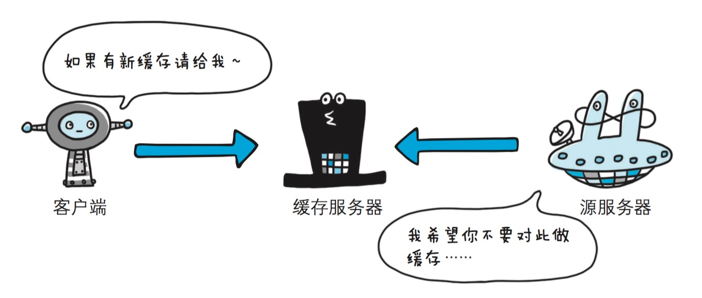

### Http Cache
http缓存主要有两个地方，浏览器和缓存服务器。


|参数  |含义|
|-----|-----|
|Age | Age 能告知客户端,源服务器在多久前创建了响应。字段 值的单位为秒。表示缓存服务器拿缓存了多久。|
|Date | Date 表明创建 HTTP 报文的日期和时间。|
|Cache-Control:max-age|定义了文档的最大使用期——从第一次生成文档到文档不再新鲜、无法使用为止,最大的合法生存时间(以秒为单位) Cache-Control: max-age=484200|
|Expires| 指定一个绝对的过期日期。如果过期日期已经过了,就说明文档不再新鲜了 Expires: Fri, 05 Jul 2002, 05:00:00 GMT。如果是缓存服务器，缓存服务器在这段时间内不会再去请求源服务器。Expires是HTTP/1.0的写法，HTTP/1.1使用Cache-Control:max-age。|
|Pragma | Pragma 是 HTTP/1.1 之前版本的历史遗留字段。 Cache-Control: no-cache和  Pragma: no-cache含义一样。|
|Last-Modified | 资源的最新修改时间，和If-Modified-Since是一对。|
|If-Modified-Since:date|客户端再次发送请求时会带上响应时Last-Modified的值，服务端会根据日期去比对资源是否是旧的。|
|ETag |它是一种可将资源以字符串形式做唯一性标识的方式。服务器会为每份资源分配对应的 ETag 值。客户端再发请求时会在If-None-Match带上ETag的值，服务器端回去比对是否一致，如果一致则响应304，不再发送响应体。|
|If-None-Match:tags|和Etag是一对|

### 备注

> Expires 首部和 Cache-Control: max-age 首部所做的事情本质上是一样的,但由于 Cache-Control 首部使用的是相对时间而不是绝对日期,所以我们更倾向于使用比较新的 Cache-Control 首部。绝对日期依赖于计算机时钟的正确设置。

------------------

> 仅仅是已缓存文档过期了并不意味着它和原始服务器上目前处于活跃状态的文档有实际的区别;这只是意味着到了要进行核对的时间了。这种情况被称为“服务器再 验证”,说明缓存需要询问原始服务器文档是否发生了变化。
> * 如果再验证显示内容发生了变化,缓存会获取一份新的文档副本,并将其存储在旧文档的位置上,然后将文档发送给客户端。
> * 如果再验证显示内容没有发生变化,缓存只需要获取新的首部,包括一个新的过期日期,并对缓存中的首部进行更新就行了。

----------

> If-Modified-Since 首部可以与 Last-Modified 服务器响应首部配合工作。原始 服务器会将最后的修改日期附加到所提供的文档上去。当缓存要对已缓存文档进行 再验证时,就会包含一个 If-Modified-Since 首部,其中携带有最后修改已缓存副 本的日期:
```
If-Modified-Since: <cached last-modified date>
```


### 参考
《HTTP权威指南》《图解HTTP》
