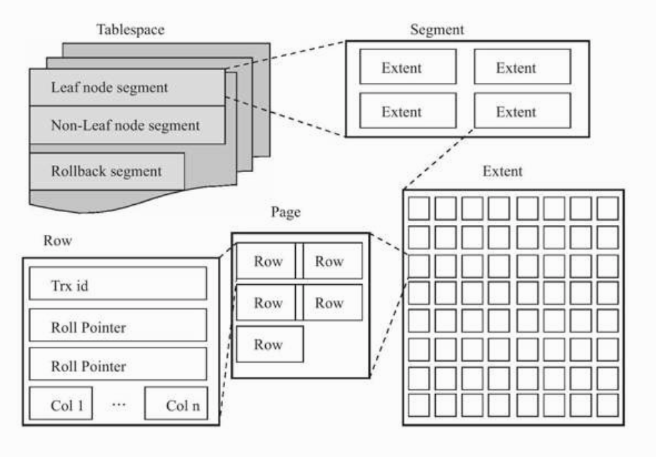
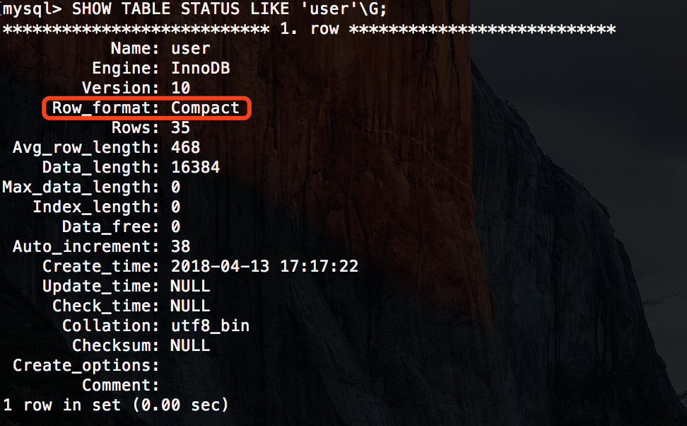

## InnoDB存储引擎 - 姜承尧

### 第四章 表
本章主要讲的是数据在表中是如何存放的。数据都被逻辑地存放在一个空间中，称之为表空间（tablespace）。表空间又由段（segment）、区（extent）、页（page）组成。

表空间有各种段组合而成，常见的段有`数据段`、`索引段`、`回滚段`。段的内部是一个个区组成，区大小固定为`1MB`。区有连续的页构成，默认情况下一个页`16KB`，也就是说有连续的64个页组成一个区。使用`innodb_page_size`可以设置页的大小。页是InnoDB磁盘管理的最小单位，每次读取写入都是最少一个页。

InnoDB记录是以行的形式存储的，这就意味着页中存的是一行一行的数据（一个页最多能存16KB/2-200行的记录，即7992行记录）。

最初版本的InnoDB提供`Compact`和`Redundant`两种格式来存放行数据，最新的版本默认使用`Compact`格式。使用命令`SHOW TABLE STATUS LIKE 'table_name'`可以查看当前表使用的行格式，`row_format`属性即表示正在使用的格式。

