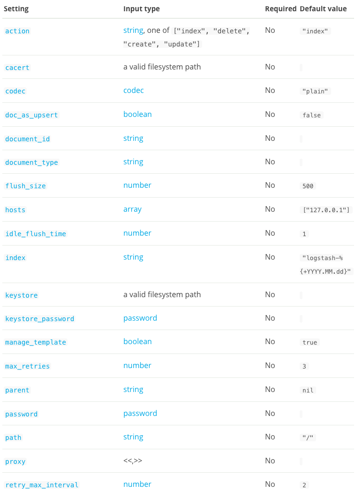

### 安装与配置
1. 导入密钥
```
rpm --import https://packages.elastic.co/GPG-KEY-elasticsearch
```

2. 配置源  
在`/etc/yum.repos.d/`目录下新建`elasticsearch.repo`写入一下内容。
```
[elasticsearch-2.x]
name=Elasticsearch repository for 2.x packages
baseurl=https://packages.elastic.co/elasticsearch/2.x/centos
gpgcheck=1
gpgkey=https://packages.elastic.co/GPG-KEY-elasticsearch
enabled=1
```

3. 安装  
```
yum clean all
# 需要jre支持
yum install java-1.8.0-openjdk.x86_64 elasticsearch -y
```

4. 配置开机启动
```
chkconfig --add elasticsearch
```

5. 启动服务
```
service elasticsearch start
```

6. 参考  
[【1】](https://www.elastic.co/guide/en/elasticsearch/reference/current/setup-repositories.html) [【2】](https://www.elastic.co/guide/en/elasticsearch/reference/current/rpm.html)


### elasticsearch和传统数据库对照关系

> 在Elasticsearch中，文档归属于一种类型(type),而这些类型存在于索引(index)中，我们可以画一些简单的对比图来类比传统关系型数据库：

```
Relational DB -> Databases -> Tables -> Rows -> Columns
Elasticsearch -> Indices   -> Types  -> Documents -> Fields
```                                                                                                                                                                                                                
Elasticsearch集群可以包含多个索引(indices)（数据库），每一个索引可以包含多个类型(types)（表），每一个类型包含多个文档(documents)（行），然后每个文档包含多个字段(Fields)（列）。

### logstash elasticsearch output 配置

<https://www.elastic.co/guide/en/logstash/current/plugins-outputs-elasticsearch.html>




### 插件
plugin install delete-by-query

### elasticsearch 配置
编辑 `vim /etc/elasticsearch/elasticsearch.yml`
``` yml

```

### 常见问题
1. system call filters failed to install; check the logs and fix your configuration or disable system call filters at your own risk

    原因：    
    这是在因为Centos6不支持SecComp，而ES5.2.0默认bootstrap.system_call_filter为true进行检测，所以导致检测失败，失败后直接导致ES不能启动。    
    解决：    
    在elasticsearch.yml中配置bootstrap.system_call_filter为false，注意要在Memory下面:    
    ```
    bootstrap.memory_lock: false    
    bootstrap.system_call_filter: false    
    ```

2. max file descriptors [4096] for elasticsearch process is too low, increase to at least [65536] 

    编辑limits.conf 文件追加   
    vim /etc/security/limits.conf   
    ```  
    elasticsearch soft nofile 65536    
    elasticsearch hard nofile 65536    
    ```

3. max number of threads [1024] for user [elasticsearch] is too low, increase to at least [2048]

    编辑90-nproc.conf 追加
    vim /etc/security/limits.d/90-nproc.conf 
    ```
    elasticsearch soft nproc 2048
    ```

4. 报找不到JAVA_HOME

    配置elasticsearch环境变量 ，增加  
    vim /etc/sysconfig/elasticsearch
    ```
    # Elasticsearch Java path JAVA_HOME
    # Elasticsearch Java path
    JAVA_HOME=/usr/local/java/
    ```

5. can not run elasticsearch as root

    不能以root用户启动ES服务器。新建elasticsearch运行。

6. Could not register mbeans java.security.AccessControlException: access denied ("javax.management.MBeanTrustPermission" "register")

    找到使用的jre (find / -name java.policy) jre/lib/security/java.policy 追加
    ```
    permission javax.management.MBeanTrustPermission "register";
    ```

7. Fielddata is disabled on text fields by default.

    - <https://www.elastic.co/guide/en/elasticsearch/reference/current/fielddata.html>
    - <http://blog.csdn.net/u011403655/article/details/71107415>


### 参考
- <http://blog.csdn.net/feifantiyan/article/details/54614614>  
- <http://blog.csdn.net/cardinalzbk/article/details/54924511>
- <https://yemengying.com/2016/03/18/Elasticsearch%E9%85%8D%E7%BD%AE%E9%A1%B9-Local-gateway-HTTP-Indices-Network-Settings%E6%A8%A1%E5%9D%97%E9%85%8D%E7%BD%AE/>
- <http://es.xiaoleilu.com/010_Intro/25_Tutorial_Indexing.html>
