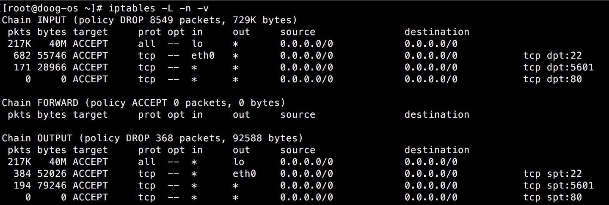
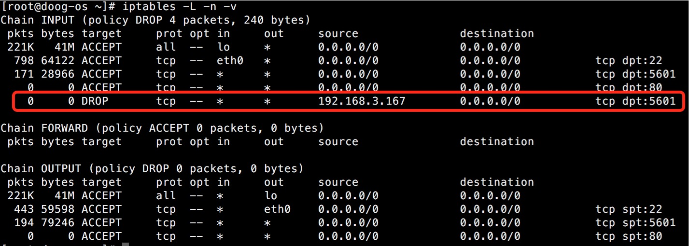
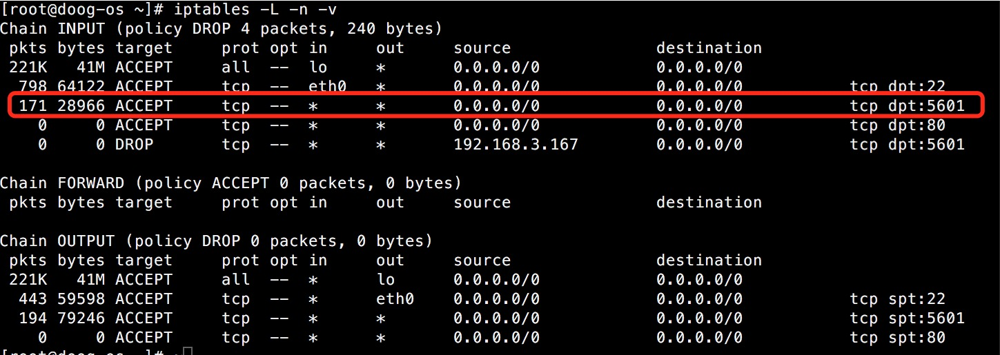

### 规则写法
```
iptables [-t table] COMMAND chain CRETIRIA -j ACTION
```
-t table: 4个`filter` `nat` `mangle` `raw`，默认为`filter`
COMMAND: 定义如何对规则进行管理
chain: 指定你接下来的规则到底是在哪个链上操作的，当定义策略的时候，是可以省略的
CRETIRIA: 指定匹配标准
-j ACTION: 指定如何进行处理

例如，开放80端口：
```
iptables -t filter -A INPUT -p tcp --dport 80 -j ACCEPT
```
这里的-t为`filter`  
COMMAND为`-A INPUT`   
CRETIRIA为`-p tcp --dport 80`  
-j为`ACCEPT`  

#### COMMAND命令
1. 链管理命令
    -P: 设置默认策略的（设定默认门是关着的还是开着的）
    默认策略一般只有两种
    ```
    iptables -P INPUT (DROP|ACCEPT)  默认是关的/默认是开的
    ```
    比如：
    ```
    iptables -P INPUT DROP
    ```
    这就把默认规则给拒绝了。并且没有定义哪个动作，所以关于外界连接都会被拒绝。

    -F: FLASH，清空规则链的(注意每个链的管理权限)
    ```
    iptables -t nat -F PREROUTING
    iptables -t nat -F 清空nat表的所有链
    ```

    -N: 支持用户新建一个链
    ```
    iptables -N Docker
    ```
    创建后，使用-L命令查看发现会多一条规则链

    -X: 用于删除用户自定义的空链
    使用方法跟-N相同，但是在删除之前必须要将里面的链给清空昂了

    -E: 用来Rename chain主要是用来给用户自定义的链重命名
    ```
    iptables -E Docker docker
    ```

    -Z: 清空链，及链中默认规则的计数器的（有两个计数器，被匹配到多少个数据包，多少个字节）
    ```
    iptables -Z INPUT
    ```

2. 规则管理命令
    -A: 追加，在当前链的最后新增一个规则
    ```
    iptables -A INPUT -p tcp --dport 80 -j ACCEPT
    ```
    -I num : 插入，把当前规则插入为第几条
    ```
    # 禁止192.168.3.167访问5601端口，插入到第一条规则
    iptables -I INPUT 1 -s 192.168.3.167 -p tcp --dport 5601 -j DROP
    ```
    -R num：Replays替换/修改第几条规则
    ```
    # 修改第一条规则
    iptables -R INPUT 1 -s 192.168.3.167 -p tcp --dport 5601 -j ACCEPT
    ```
    -D num：删除，明确指定删除第几条规则
    ```
    iptables -D INPUT 1
    ```
3. 查看管理命令"-L"
    附加子命令  
    -n: 以数字的方式显示ip，它会将ip直接显示出来，如果不加-n，则会将ip反向解析成主机名  
    -v: 显示详细信息  
    -vv  
    -vvv: 越多越详细  
    -x: 在计数器上显示精确值，不做单位换算  
    --line-numbers: 显示规则的行号  
    -t nat：显示所有的关卡的信息  
    ```
    iptables -L -n -v --line-numbers
    ```

#### 匹配标准CRETIRIA
1. 通用匹配
    -s：指定作为源地址匹配，这里不能指定主机名称，必须是IP
    ```
    # 匹配IP是192.168.3.167请求
    iptables -I INPUT 1 -s 192.168.3.167 -p tcp --dport 5601 -j DROP
    ```
    而且地址可以取反，加一个“!”表示除了哪个IP之外

    -d：表示匹配目标地址

    -p：用于匹配协议的（这里的协议通常有3种，TCP/UDP/ICMP）

    -i eth0：从这块网卡流入的数据
    流入一般用在INPUT和PREROUTING上

    -o eth0：从这块网卡流出的数据
    流出一般在OUTPUT和POSTROUTING上
    ```
    # 打开回环
    iptables -A INPUT -i lo -j ACCEPT
    iptables -A OUTPUT -o lo -j ACCEPT
    ```
2. 扩展匹配
    1. 隐含扩展：对协议的扩展
    -p tcp: TCP协议的扩展。一般有三种扩展
        --dport XX-XX：指定目标端口,不能指定多个非连续端口,只能指定单个端口，比如
        --dport 21  或者 --dport 21-23 (此时表示21,22,23)
        --sport：指定源端口
        --tcp-fiags：TCP的标志位（SYN,ACK，FIN,PSH，RST,URG）
        对于它，一般要跟两个参数：
        1.检查的标志位
        2.必须为1的标志位
        --tcpflags syn,ack,fin,rst syn   =    --syn
        表示检查这4个位，这4个位中syn必须为1，其他的必须为0。所以这个意思就是用于检测三次握手的第一次包的。对于这种专门匹配第一包的SYN为1的包，还有一种简写方式，叫做--syn
    -p udp：UDP协议的扩展
        --dport
        --sport
    -p icmp：icmp数据报文的扩展
        --icmp-type：
            echo-request(请求回显)，一般用8 来表示
            所以 --icmp-type 8 匹配请求回显数据包
            echo-reply （响应的数据包）一般用0来表示
    2. 显式扩展（-m）
    扩展各种模块  
    -m multiport：表示启用多端口扩展  
    之后我们就可以启用比如 --dports 21,23,80  

#### 详解 -j ACTION
1. DROP：悄悄丢弃
    一般我们多用DROP来隐藏我们的身份，以及隐藏我们的链表
2. REJECT：明示拒绝
3. ACCEPT：接受
    custom_chain：转向一个自定义的链
4. DNAT
5. SNAT
6. MASQUERADE：源地址伪装
7. REDIRECT：重定向：主要用于实现端口重定向
8. MARK：打防火墙标记的
9. RETURN：返回
    在自定义链执行完毕后使用返回，来返回原规则链。


### 规则的先后顺序
iptables规则的顺序很重要，配置不好规则会起不到预想的效果。
例如，现在有如下规则

现在想要加一个规则，不让IP是192.168.3.167的用户访问5601端口
运行下面命令添加一条规则
```
iptables -A INPUT 1 -s 192.168.3.167 -p tcp --dport 5601 -j DROP
```

添加后，测试后发现根本没有起作用。为什么出现这种情况？因为规则在匹配时是从上到下，如果匹配成功就执行后面的Action了。在这里，IP是192.168.3.167的用户在请求5601端口时首先会匹配到第三条规则

匹配后，直接就ACCEPT了。而最后一条拦截IP192.168.3.167的规则根本就不会执行。这种情况下，把拦截规则放到第一位就可以了
```
iptables -t filter -I INPUT 1 -s 192.168.3.167 -p tcp --dport 5601 -j DROP
```


### TIPS
1、 直接通过命令配置的规则在重启后就丢失了，要想重启后也生效。可以运行`service iptables save`命令保存。


2、 运行wget命令报不能dns不能解析错误
这个问题的主要原因是没有开放53端口，这个地方有个需要注意的。这里是从本地发起的请求，所以INPUT规则中应该指定--sport 53，OUTPUT规则中要指定--dport 53  

```
iptables -A OUTPUT -o eth0 -p udp --dport 53 -j ACCEPT

iptables -A INPUT -i eth0 -p udp --sport 53 -j ACCEPT
```  

配置完这个发现还是不行，原因类似。还需要开发从本地发起的HTTP，HTTPS请求。下面是完整的配置ssh、http、https的例子

```
从外部发起的请求
iptables -A OUTPUT -o eth0 -p tcp --dport 443 -m state --state NEW,ESTABLISHED -j ACCEPT
iptables -A INPUT -i eth0 -p tcp --sport 443 -m state --state ESTABLISHED -j ACCEPT

从本机发起的请求
iptables -A OUTPUT -o eth0 -p tcp -m multiport --dports 22,80,443  -j ACCEPT
iptables -A INPUT -i eth0 -p tcp -m multiport --sports 22,80,443  -j ACCEPT
```


### 参考
[【1】](http://blog.chinaunix.net/uid-26495963-id-3279216.html) [【2】](http://blog.chinaunix.net/uid-9950859-id-98279.html)
