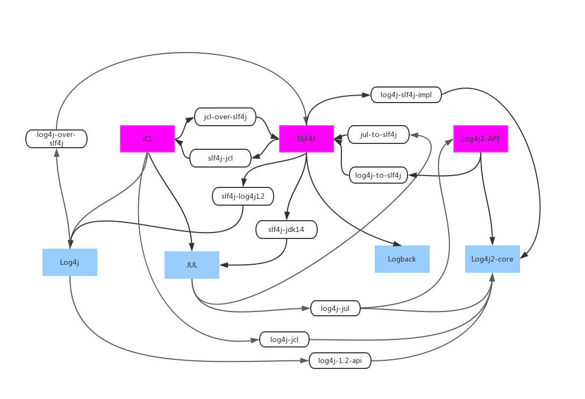

### Java 日志库
Java 拥有功能和性能都非常强大的日志库。比较常见的有 java.util.logging（jul）、Apache Common Logging（jcl）、Apache Log4j 1.x、Apache Log4j 2、SLF4J、Logback。

### 日志规范和实现
在这些常见的类库中可以分为两类，一类是规范，另一类是日志实现。  

最开始 Java 中没有提供日志 API，后来 Apache 推出了 Log4j，很多项目开始使用了 Log4j 来记录日志。接着 Sun 在 Java1.4 中推出了 jul。现在就有两种日志实现了。开始很多项目中直接使用日志实现，这样对后面切换日志实现很不方便，这时候 jcl 出现了。jcl 只是定义了一套日志接口，支持运行时动态加载日志组件的实现，也就是说，在你应用代码里，只需调用Commons Logging的接口，底层实现可以是 Log4j，也可以是 jul。

后来又出现了 SLF4J（接口）、Logback（实现） 以及 Log4j 的升级版 Log4j 2，这里面Log4j 2 又分为两部分，log4j-api、log4j-core。log4j-api 是日志接口，log4j-core 是日志实现。

### 统一
一个项目中如果存在多种日志接口和实现是很混乱的，我们可以使用各种 Adapter 和 Bridge 把日志连接起来。slf4j-XXX-version.jar 和 XXX-over-slf4j.jar 就是做这种事情的。


> 项目中引用日志类库时注意不要造成日志流转的死循环

我们可以用 jcl-over-slf4j 来替换 jcl，使用 log4j-over-slf4j 来替换 log4j。可以通过 ` mvn dependency:tree | nl -ba` 来打印出依赖关系。排除依赖的第三方库中的 Log  依赖。

下面的例子是把 log4j、jcl 全部通过桥接器将日志输出到 SLF4J，最后通过 Logback 输出。
``` xml
<dependencies>
    <dependency>
        <groupId>com.alibaba.otter</groupId>
        <artifactId>canal.client</artifactId>
        <version>1.0.24</version>
        <exclusions>
            <!-- 排除日志第三方库中的日志依赖 -->
            <exclusion>
                <groupId>log4j</groupId>
                <artifactId>log4j</artifactId>
            </exclusion>
            <exclusion>
                <groupId>ch.qos.logback</groupId>
                <artifactId>logback-core</artifactId>
            </exclusion>
            <exclusion>
                <groupId>ch.qos.logback</groupId>
                <artifactId>logback-classic</artifactId>
            </exclusion>
            <exclusion>
                <groupId>org.slf4j</groupId>
                <artifactId>jcl-over-slf4j</artifactId>
            </exclusion>
            <exclusion>
                <groupId>org.slf4j</groupId>
                <artifactId>slf4j-api</artifactId>
            </exclusion>
            <exclusion>
                <groupId>commons-logging</groupId>
                <artifactId>commons-logging</artifactId>
            </exclusion>
        </exclusions>
    </dependency>

    <dependency>
        <groupId>org.elasticsearch.client</groupId>
        <artifactId>transport</artifactId>
        <version>5.3.0</version>
        <exclusions>
            <!-- 排除日志第三方库中的日志依赖 -->
            <exclusion>
                <groupId>commons-logging</groupId>
                <artifactId>commons-logging</artifactId>
            </exclusion>
        </exclusions>
    </dependency>

    <!-- logging -->
    <!--log4j → slf4j-->
    <dependency>
        <groupId>org.slf4j</groupId>
        <artifactId>log4j-over-slf4j</artifactId>
        <version>1.7.25</version>
    </dependency>
    <!--log4j 2 → slf4j-->
    <dependency>
        <groupId>org.apache.logging.log4j</groupId>
        <artifactId>log4j-to-slf4j</artifactId>
        <version>2.8.2</version>
    </dependency>
    <!-- jcl → slf4j -->
    <dependency>
        <groupId>org.slf4j</groupId>
        <artifactId>jcl-over-slf4j</artifactId>
        <version>1.7.25</version>
    </dependency>
    <!-- jul → slf4j -->
    <dependency>
        <groupId>org.slf4j</groupId>
        <artifactId>jul-to-slf4j</artifactId>
        <version>1.7.25</version>
    </dependency>

    <dependency>
        <groupId>org.slf4j</groupId>
        <artifactId>slf4j-api</artifactId>
        <version>1.7.25</version>
    </dependency>
    <dependency>
        <groupId>ch.qos.logback</groupId>
        <artifactId>logback-core</artifactId>
        <version>1.2.3</version>
        <scope>runtime</scope>
    </dependency>
    <dependency>
        <groupId>ch.qos.logback</groupId>
        <artifactId>logback-classic</artifactId>
        <version>1.2.3</version>
        <scope>runtime</scope>
    </dependency>
</dependencies>
```

### 参考
[【1】](http://www.infoq.com/cn/articles/things-of-java-log-performance) [【2】](http://blog.csdn.net/yycdaizi/article/details/8276265) [【3】](http://leonmau.blog.51cto.com/2202260/808763) [【4】](https://zhuanlan.zhihu.com/p/24272450) [【5】](https://zhuanlan.zhihu.com/p/24275518) [【6】](http://www.cnblogs.com/chenhongliang/p/5312517.html)
