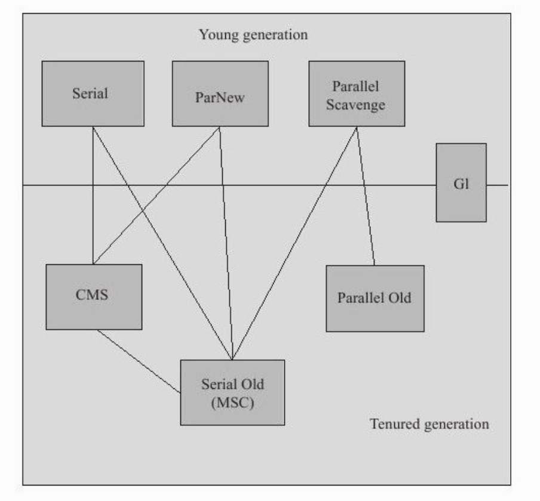

## Java虚拟机

### Java内存区域

- 程序计数器

    程序计数器（Program Counter Register）是一块较小的内存空间，它可以看作是当前线程所执行的字节码的行号指示器。在虚拟机的概念模型里（仅是概念模型，各种虚拟机可能会通过一些更高效的方式去实现），字节码解释器工作时就是通过改变这个计数器的值来选取下一条需要执行的字节码指令，分支、循环、跳转、异常处理、线程恢复等基础功能都需要依赖这个计数器来完成。

- Java虚拟机栈

    与程序计数器一样，Java虚拟机栈（Java Virtual Machine Stacks）也是线程私有的，它的生命周期与线程相同。虚拟机栈描述的是Java方法执行的内存模型：每个方法在执行的同时都会创建一个栈帧（Stack Frame[1]）用于存储**局部变量表**、操作数栈、动态链接、方法出口等信息。每一个方法从调用直至执行完成的过程，就对应着一个栈帧在虚拟机栈中入栈到出栈的过程。

    如果线程请求的栈深度大于虚拟机所允许的深度，将抛出`StackOverflowError`异常，这个在递归时可能会发生。如果栈空间支持动态扩展，当无法申请到足够内存是也会抛出`OutOfMemoryError`异常。

    使用设置`-Xss`可以设置栈大小。虚拟机栈是线程独有的，每个线程分配到的栈容量越大，可以建立的线程数量自然就越少，建立线程时就越容易把剩下的内存耗尽。

- 本地方法栈

    本地方法栈与虚拟机栈类似，只是这里虚拟机使用到的Native方法服务。这里同样可能会抛出`StackOverflowError`和`OutOfMemoryError`异常。
    
- Java堆

    Java堆是Java里面最大的一块内存。Java堆是被所有线程共享的一块内存区域，在虚拟机启动时创建。此内存区域的唯一目的就是存放对象实例。垃圾回收也主要在堆去进行。

    使用`-Xms`和`-Xmx`来设置堆的初始和最大大小，很多软件都建议将两者设置的一样大。

    如果申请不到足够的内存这里会抛出`OutOfMemoryError`异常，后面会跟着进一步提示"Java heap space"。

    `TLAB`全称ThreadLocalAllocBuffer，是线程的一块私有内存。如果设置了虚拟机参数 -XX:UseTLAB，在线程初始化时，同时也会申请一块指定大小的内存，只给当前线程使用，这样每个线程都单独拥有一个Buffer。如果需要分配内存，就在自己的Buffer上分配，这样就不存在竞争的情况，**可以大大提升分配效率**（均摊对GC堆（eden区）里共享的分配指针做更新而带来的同步开销。），当Buffer容量不够的时候，再重新从Eden区域申请一块继续使用，这个申请动作还是需要原子操作的。TLAB只是让每个线程有私有的分配指针，但底下存对象的内存空间还是给所有线程访问的，只是其它线程无法在这个区域分配而已。。可以通过`-XX:+/-UseTLAB`参数来设定。

- 方法区

    这里主要**类信息**、*常量*（不同版本的虚拟机常量存储地方可能不同）、静态变量、即时编译器编译后的代码等数据。

    运行时常量池（Runtime Constant Pool）是方法区的一部分。Class文件中除了有类的版本、字段、方法、接口等描述信息外，还有一项信息是常量池（Constant Pool Table），用于存放编译期生成的各种字面量和符号引用，这部分内容将在类加载后进入方法区的运行时常量池中存放。

    对于需要大量动态生成类的框架（Spring）这里可能会发生内存溢出，后面会提示"PermGen space"。

    使用`-XX:MaxPermSize`设置方法区内存上限。
    
- 直接内存

    直接内存（Direct Memory）并不是虚拟机运行时数据区的一部分。从Java1.4 NIO开始，我们可以直接使用堆外内存。`DirectByteBuffer`对象作为对这部分内存的引用进行操作。这样能在一些场景中显著提高性能，因为避免了在Java堆和Native堆中来回复制数据。

    堆内存不受Java虚拟机堆内存限制，但是它会受到本机总内存限制。当内存不足是会发生`OutOfMemoryError`异常。

    使用`-XX:MaxDirectMemorySize`设置，如果不指定默认和`-Xmx`一样大。


### 垃圾回收

垃圾回收的优点是程序员不需要再手动去管理内存了，它的缺点是在回收过程中程序会出现短暂暂停，这在某些常见下是不能允许的。

> 在标记阶段必须要暂停一定的时间来遍历`GC Roots`链，不可以出现分析过程中对象引用关系还在不断变化的情况，该点不满足的话分析结果准确性就无法得到保证。

#### GC主要算法

1. 引用计数算法

    给对象中添加一个引用计数器，每当有一个地方引用它时，计数器值就加1；当引用失效时，计数器值就减1；任何时刻计数器为0的对象就是不可能再被使用的。

    引用计数算法有可以立即回收、不用遍历整个堆等优点，但是它比较少使用，因为它有个很大的缺点是不能解决相互依赖问题。

2. 标记-清除算法

    标记清除算法分为两个阶段，标记和清除。第一阶段使用可达性分析算法从`GC Roots`作为起点开始搜索。当一个对象到GC Roots没有任何引用链相连时，则证明此对象是不可用的，它们将会被判定为是可回收的对象。

    首先标记出所有需要回收的对象，在标记完成后统一回收所有被标记的对象。这种算法有个缺点，清除后内存上会有大量空洞，存在大量不连续的空间。如果分配较大内存的对象时可能会出现内存问题。为了解决这个问题，在这个基础上人们又提出了下面的复制算法。

3. GC复制算法

    复制算法将内存分为大小相同的两块，每次只是用其中一块。当其中一块满了以后将里面存活的对象全部复制到另一块去，然后将这块内存全部清理掉。这种算法的缺点就是每次只能使用一半内存，存在一些浪费的问题。

    根据研究报名，大部分新对象经过一次GC就会被回收掉，所以不需要按照1:1的比例来划分两块内存，而是将内存分为一份较大的`Eden`空间和两份`Survivor`空间。每次只使用`Eden`和一份`Survivor`空间，当回收时将`Eden`和正在使用的`Survivor`空间里面存活的对象全都复制到另一个`Survivor`空间中。然后一次性清理掉原来的`Eden`和`Survivor`空间。这样每次只浪费一份`Survivor`的内存，HotSpot虚拟机默认Eden和Survivor的大小比例是8:1，也就是说每次只浪费10%的内存空间。

4. 标记-整理算法

    标记整理算法是在上述算法基础上发展而来的。它会使用整个内存，标记阶段完成后将存活的对象朝内存的一端移动，然后直接清理掉端边界以外的内存。

#### Java中的GC

`HotSpot`（包括其它主流虚拟机）都采用`分代收集`的策略，这主要是因为新对象和老对象存活周期不同。一般的新对象普遍在一轮GC后就被回收了，如果对象经过两轮GC还活着那可能这个对象还会存活很久。对象存活周期不同，这就使我们在进行垃圾回收时选择不同的策略来回收两种对象。

`HotSpot`中有几种垃圾回收器，不同的垃圾回收器使用了不同的算法。



- Serial收集器

    Serial收集器是最古老的收集器，它的缺点是当Serial收集器想进行垃圾回收的时候，必须暂停用户的所有进程，即`stop the world`。到现在为止，它依然是虚拟机运行在client模式下的默认新生代收集器，与其他收集器相比，对于限定在单个CPU的运行环境来说，Serial收集器由于没有线程交互的开销，专心做垃圾回收自然可以获得最高的单线程收集效率。

    Serial Old是Serial收集器的老年代版本，它同样是一个单线程收集器，使用`标记－整理`算法。这个收集器的主要意义也是被Client模式下的虚拟机使用。在Server模式下，它主要还有两大用途：一个是在JDK1.5及以前的版本中与Parallel Scanvenge收集器搭配使用，另外一个就是作为CMS收集器的后备预案，在并发收集发生Concurrent Mode Failure的时候使用。

    通过指定`-XX:-UseSerialGC`参数，使用Serial + Serial Old的串行收集器组合进行内存回收。

- ParNew收集器

    ParNew收集器是Serial收集器新生代的多线程实现，注意在进行垃圾回收的时候依然会`stop the world`，只是相比较Serial收集器而言它会运行多条进程进行垃圾回收。

    ParNew收集器在单CPU的环境中绝对不会有比Serial收集器更好的效果，甚至由于存在线程交互的开销，该收集器在通过超线程技术实现的两个CPU的环境中都不能百分之百的保证能超越Serial收集器。当然，随着可以使用的CPU的数量增加，它对于GC时系统资源的利用还是很有好处的。它默认开启的收集线程数与CPU的数量相同，在CPU非常多（譬如32个，现在CPU动辄4核加超线程，服务器超过32个逻辑CPU的情况越来越多了）的环境下，可以使用`-XX:ParallelGCThreads`参数来限制垃圾收集的线程数。

    `-XX:-UseParNewGC`打开此开关后，使用ParNew + Serial Old的收集器组合进行内存回收，这样新生代使用并行收集器，老年代使用串行收集器。如果配置`-XX:+UseConcMarkSweepGC`选项后的默认新生代收集器也是ParNew收集器。

- Parallel Scavenge收集器

    Parallel是采用复制算法的多线程新生代垃圾回收器，似乎和ParNew收集器有很多的相似的地方。但是Parallel Scanvenge收集器的一个特点是它所关注的目标是**吞吐量**(Throughput)。所谓吞吐量就是CPU用于运行用户代码的时间与CPU总消耗时间的比值，即`吞吐量 = 运行用户代码时间 / (运行用户代码时间 + 垃圾收集时间)`，虚拟机总共运行了100分钟，其中垃圾收集花掉1分钟，那吞吐量就是99%。Parallel Old收集器是Parallel Scavenge收集器的老年代版本，采用多线程和`标记－整理`算法。这个收集器是在jdk1.6中才开始提供的，在此之前，新生代的Parallel Scavenge收集器一直处于比较尴尬的状态。原因是如果新生代Parallel Scavenge收集器，那么老年代除了Serial Old(PS MarkSweep)收集器外别无选择。由于单线程的老年代Serial Old收集器在服务端应用性能上的"拖累"，即使使用了Parallel Scavenge收集器也未必能在整体应用上获得吞吐量最大化的效果，又因为老年代收集中无法充分利用服务器多CPU的处理能力，在老年代很大而且硬件比较高级的环境中，这种组合的吞吐量甚至还不一定有ParNew加CMS的组合"给力"。直到Parallel Old收集器出现后，"吞吐量优先"收集器终于有了比较名副其实的应用，在注重吞吐量及CPU资源敏感的场合，都可以优先考虑Parallel Scavenge加Parallel Old收集器。
    
    Parallel Scavenge收集器提供了两个参数用于精确控制吞吐量，分别是控制最大垃圾收集停顿时间的`-XX:MaxGCPauseMillis`参数以及直接设置吞吐量大小的`-XX:GCTimeRatio`参数。

    `-XX:UseParallelGC`虚拟机运行在Server模式下的默认值，打开此开关后，使用Parallel Scavenge + Serial Old的收集器组合进行内存回收。`-XX:UseParallelOldGC`打开此开关后，使用Parallel Scavenge + Parallel Old的收集器组合进行垃圾回收。

    
- CMS收集器

    CMS(Concurrent Mark Swep)收集器是一个比较重要的回收器，现在应用非常广泛，我们重点来看一下，CMS一种获取最短回收停顿时间为目标的收集器，这使得它很适合用于和用户交互的业务。从名字(Mark Swep)就可以看出，CMS收集器是基于标记清除算法实现的。它的收集过程分为四个步骤：

    1. 初始标记(initial mark)
    2. 并发标记(concurrent mark)
    3. 重新标记(remark)
    4. 并发清除(concurrent sweep)

    注意初始标记和重新标记还是会stop the world，但是在耗费时间更长的并发标记和并发清除两个阶段都可以和用户进程同时工作。

    不过由于CMS收集器是基于标记清除算法实现的，会导致有大量的空间碎片产生，在为大对象分配内存的时候，往往会出现老年代还有很大的空间剩余，但是无法找到足够大的连续空间来分配当前对象，不得不提前开启一次Full GC。为了解决这个问题，CMS收集器默认提供了一个`-XX:+UseCMSCompactAtFullCollection`收集开关参数（默认就是开启的)，用于在CMS收集器进行FullGC完开启内存碎片的合并整理过程，内存整理的过程是无法并发的，这样内存碎片问题倒是没有了，不过停顿时间不得不变长。虚拟机设计者还提供了另外一个参数`-XX:CMSFullGCsBeforeCompaction`参数用于设置执行多少次不压缩的FULL GC后跟着来一次带压缩的（默认值为0，表示每次进入Full GC时都进行碎片整理）。

    不幸的是，它作为老年代的收集器，却无法与jdk1.4中已经存在的新生代收集器Parallel Scavenge配合工作，所以在jdk1.5中使用CMS来收集老年代的时候，新生代只能选择ParNew或Serial收集器中的一个。

    `-XX:CMSInitiatingOccupancyFraction`配置可以设置老年代使用了多少空间后才进行GC。默认是68%，这是一个偏保守的设置，我们可以适当的调高这个参数。除了前面的配置外，我们还需要配置`-XX:+UseCMSInitiatingOccupancyOnly`这要求JVM不基于运行时的数据来进行GC，每次JVM都通过CMSInitiatingOccupancyFraction的值进行CMS收集。

- G1收集器

    G1收集器是一款面向服务端应用的垃圾收集器。HotSpot团队赋予它的使命是在未来替换掉JDK1.5中发布的CMS收集器。与其他GC收集器相比，G1具备如下特点：

    - 并行与并发
      
        G1能更充分的利用CPU，多核环境下的硬件优势来缩短stop the world的停顿时间。
        
    - 分代收集
    
        和其他收集器一样，分代的概念在G1中依然存在，不过G1不需要其他的垃圾回收器的配合就可以独自管理整个GC堆。

    - 空间整合
    
        G1收集器有利于程序长时间运行，分配大对象时不会无法得到连续的空间而提前触发一次GC。

    - 可预测的非停顿
    
        这是G1相对于CMS的另一大优势，降低停顿时间是G1和CMS共同的关注点，能让使用者明确指定在一个长度为M毫秒的时间片段内，消耗在垃圾收集上的时间不得超过N毫秒。

    在使用G1收集器时，Java堆的内存布局和其他收集器有很大的差别，它将这个Java堆分为多个大小相等的独立区域，虽然还保留新生代和老年代的概念，但是新生代和老年代不再是物理隔离的了，它们都是一部分Region（不需要连续）的集合。
    虽然G1看起来有很多优点，实际上CMS还是主流。

#### 与GC相关的常用参数

- Xmx
    
    设置堆内存的最大值。
    
- Xms
    
    设置堆内存的初始值。
    
- Xmn
    
    设置新生代的大小。
    
- Xss
    
    设置栈的大小。
    
- -XX:PretenureSizeThreshold
    
    直接晋升到老年代的对象大小，设置这个参数后，大于这个参数的对象将直接在老年代分配。
    
- -XX:MaxTenuringThrehold
    
    晋升到老年代的对象年龄。每个对象在坚持过一次Minor GC之后，年龄就会加1，当超过这个参数值时就进入老年代。
    
- -XX:UseAdaptiveSizePolicy
    
    在这种模式下，新生代的大小、eden 和 survivor 的比例、晋升老年代的对象年龄等参数会被自动调整，以达到在堆大小、吞吐量和停顿时间之间的平衡点。在手工调优比较困难的场合，可以直接使用这种自适应的方式，仅指定虚拟机的最大堆、目标的吞吐量 (GCTimeRatio) 和停顿时间 (MaxGCPauseMills)，让虚拟机自己完成调优工作。
    
- -XX:SurvivorRatio
    
    新生代Eden区域与Survivor区域的容量比值，默认为8，代表Eden: Suvivor= 8: 1。

- –XX:TargetSurvivorRatio=90
    
    设置 Survivor 区的可使用率。这里设置为 90%，则允许 90%的 Survivor 空间被使用。默认值是 50%。故该设置提高了 Survivor 区的使用率。当存放的对象超过这个百分比，则对象会向年老代压缩。因此，这个选项更有助于将对象留在年轻代。

- -XX:ParallelGCThreads

    设置用于垃圾回收的线程数。通常情况下可以和 CPU 数量相等。但在 CPU 数量比较多的情况下，设置相对较小的数值也是合理的。
    
- XX:MaxGCPauseMills

    设置最大垃圾收集停顿时间。它的值是一个大于 0 的整数。收集器在工作时，会调整 Java 堆大小或者其他一些参数，尽可能地把停顿时间控制在 MaxGCPauseMills 以内。
    
- XX:GCTimeRatio
    
    设置吞吐量大小，它的值是一个 0-100 之间的整数。假设 GCTimeRatio 的值为 n，那么系统将花费不超过 1/(1+n) 的时间用于垃圾收集。

- -XX:+PrintGCDetails

    打印GC日志。

下面是ElasticSearch的一份初始化配置
```
## JVM configuration

################################################################
## IMPORTANT: JVM heap size
################################################################
## ElasticSearch 要求堆最小内存等于堆最大内存，初始化时就一次性初始化好整个堆，避免频繁重新扩展堆内存。
## You should always set the min and max JVM heap
## size to the same value. For example, to set
## the heap to 4 GB, set:
##
## -Xms4g
## -Xmx4g
##
## See https://www.elastic.co/guide/en/elasticsearch/reference/current/heap-size.html
## for more information
##
################################################################

# Xms represents the initial size of total heap space
# Xmx represents the maximum size of total heap space

-Xms2G
-Xmx2G

################################################################
## Expert settings
################################################################
##
## All settings below this section are considered
## expert settings. Don't tamper with them unless
## you understand what you are doing
##
################################################################

## GC configuration
# 使用CMS收集器（新生代默认的收集器为ParNew）
-XX:+UseConcMarkSweepGC
# 老年代容量到大75开始进行垃圾回收
-XX:CMSInitiatingOccupancyFraction=75
# 不基于运行时收集的数据来启动CMS垃圾收集周期，强制每次都使用CMSInitiatingOccupancyFraction的配置。
-XX:+UseCMSInitiatingOccupancyOnly
# 垃圾回收线程数（本机只有一个核心）
-XX:ParallelGCThreads=1

## optimizations

# disable calls to System#gc
# 屏蔽掉System.gc()
-XX:+DisableExplicitGC

# pre-touch memory pages used by the JVM during initialization
-XX:+AlwaysPreTouch

## basic

# force the server VM
# 以Server模式启动
-server

# set to headless, just in case
-Djava.awt.headless=true

# ensure UTF-8 encoding by default (e.g. filenames)
-Dfile.encoding=UTF-8

# use our provided JNA always versus the system one
-Djna.nosys=true

# flag to explicitly tell Netty to not use unsafe
-Dio.netty.noUnsafe=true

## heap dumps

# generate a heap dump when an allocation from the Java heap fails
# heap dumps are created in the working directory of the JVM
# 虚拟机在出现内存溢出异常时Dump出当前的内存堆转储快照
-XX:+HeapDumpOnOutOfMemoryError

# specify an alternative path for heap dumps
# ensure the directory exists and has sufficient space
#-XX:HeapDumpPath=${heap.dump.path}

## GC logging
# GC 日志

# 输出GC的详细日志
#-XX:+PrintGCDetails
# 输出GC的时间戳（以基准时间的形式）
#-XX:+PrintGCTimeStamps
# 输出GC的时间戳（以日期的形式，如 2013-05-04T21:53:59.234+0800）
#-XX:+PrintGCDateStamps
#-XX:+PrintClassHistogram
#-XX:+PrintTenuringDistribution
#-XX:+PrintGCApplicationStoppedTime

# log GC status to a file with time stamps
# ensure the directory exists
#-Xloggc:${loggc}

# Elasticsearch 5.0.0 will throw an exception on unquoted field names in JSON.
# If documents were already indexed with unquoted fields in a previous version
# of Elasticsearch, some operations may throw errors.
#
# WARNING: This option will be removed in Elasticsearch 6.0.0 and is provided
# only for migration purposes.
#-Delasticsearch.json.allow_unquoted_field_names=true
```

### 类加载阶段
1. 加载和验证

    从磁盘或者网络中读取class文件，检查class文件是否符合规范。

2. 准备和解析

    分配内存（静态变量初始化），找出类的依赖关系。

3. 初始化

    初始化静态变量，还会运行静态初始化代码块。

### ClassLoader
类加载采用`双亲委派模型`，`双亲委派模型`要求除了顶层的启动类加载器外，其余的类加载器都应当有自己的父类（不是继承关系，使用组合实现）加载器。`双亲委派模型`要求类加载器收到了类加载的请求要先委派给父类加载器去完成，只有当父加载器反馈自己无法完成这个加载请求（它的搜索范围中没有找到所需的类）时，子加载器才会尝试自己去加载。

这保证了虚拟机的安全性，我们不能自定义一个类加载器去加载我们自己写的`java.lang.Object`。
1. Bootstrap ClassLoader

    负责加载`＜JAVA_HOME＞\lib`中的类。

2. Extension ClassLoader

    负责加载`＜JAVA_HOME＞\lib\ext`目录中的类。

3. Application ClassLoader

    负责加载用户类路径（ClassPath）上所指定的类库，开发者可以直接使用这个类加载器。如果应用程序中没有自定义过自己的类加载器，一般情况下这个就是程序中默认的类加载器。
    
    > ClassPath用来告诉解释器从哪里寻找类，可以使用`-classpath`选项，或者设定`CLASSPATH`环境变量。一般我们会配置全局`CLASSPATH`，多个文件夹用分隔符分隔。注意：一般都以`.`开头，这代表当前文件夹。没有这个配置，我们直接在文件夹中运行`java [ClassName]`是找不到类的，因为它不会再当前文件夹查找。

自定义类加载器
``` java 
/**
 * 自定义类加载器一般继承于 {@link java.lang.ClassLoader}。<br>
 * 用户需要实现{@link #findClass(String)}方法加载class文件，
 * 然后调用{@link #defineClass(String, byte[], int, int)}将类文件（表示为字节数据）转换成类对象。
 */
public class SecureClassLoader extends ClassLoader {
    private String classpath;
    private String privateKey;

    /**
     * @param classpath
     * @param secret RSA私钥
     */
    public SecureClassLoader(String classpath, String secret) {
        this.classpath = classpath;
        this.privateKey = secret;
    }

    @Override
    protected Class<?> findClass(String name) throws ClassNotFoundException {
        try {
            return loadSecureClass(name);
        } catch (Exception ignored) {
            throw new ClassNotFoundException();
        }
    }

    private Class<?> loadSecureClass(String name) throws IOException {
        String[] className = name.split("\\.");
        className[className.length - 1] += ".class";

        byte[] classData = Files.readAllBytes(Paths.get(classpath, className));
        // 解密数据
        // classData = RSA.decrypt(classData, privateKey);

        return defineClass(name, classData, 0, classData.length);
    }

    public static void main(String[] args) throws Throwable {
        SecureClassLoader classLoader = new SecureClassLoader(args[0], args[1]);

        Class<?> personClass = classLoader.loadClass("cc.kekek.java.Person");

        // 构造实例
        Constructor<?> personConstructor = personClass.getConstructor(String.class, Byte.TYPE);
        Object ming = personConstructor.newInstance("小明", (byte) 10);
        System.out.println("ming = " + ming);

        System.out.println("one year later...");

        // 反射方式
        Method setAge = personClass.getMethod("setAge", Byte.TYPE);
        setAge.invoke(ming, (byte) 11);
        // 方法句柄方式
        MethodType methodType = MethodType.methodType(Void.TYPE, String.class);
        MethodHandle handle = MethodHandles.lookup().findVirtual(personClass, "setName", methodType);
        handle.invoke(ming, "ming");
        System.out.println("ming = " + ming);
    }
}
```

### 参考
- 深入理解Java虚拟机
- Java技术手册
- 垃圾回收的算法与实现
- [Java中的逃逸分析和TLAB以及Java对象分配](https://blog.csdn.net/yangzl2008/article/details/43202969)
- [JVM垃圾回收算法及回收器详解](https://www.ziwenxie.site/2017/07/24/java-jvm-gc/)
- [JVM源码分析之线程局部缓存TLAB](https://www.jianshu.com/p/cd85098cca39)
- [JVM实用参数（七）CMS收集器](http://ifeve.com/useful-jvm-flags-part-7-cms-collector/)