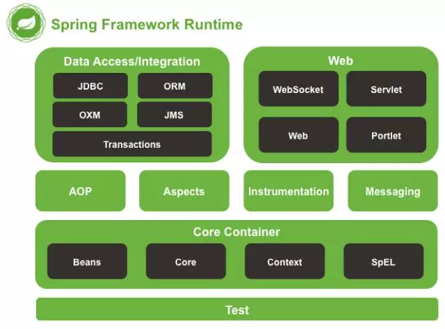
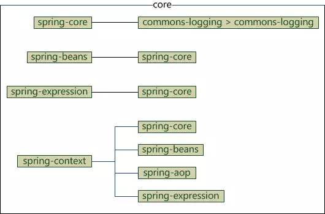
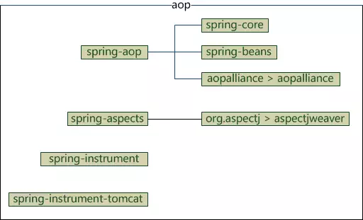
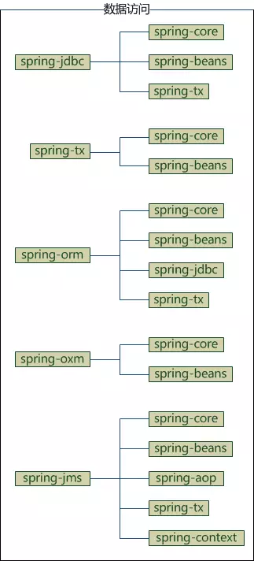
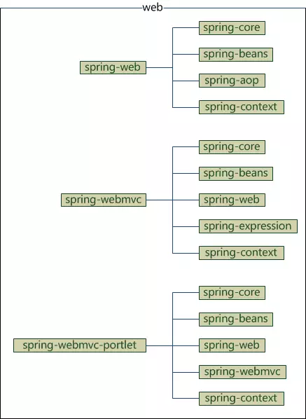
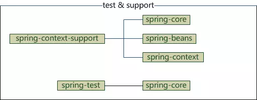
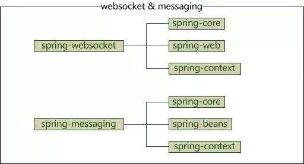

### 简介
本文主要介绍Spring Framework体系结构及内部各模块 jar 之间的依赖关系。

#### core

core部分包含4个模块

- spring-core：依赖注入IoC与DI的最基本实现
- spring-beans：Bean工厂与bean的装配
- spring-context：spring的context上下文即IoC容器
- spring-expression：spring表达式语言

#### aop

aop部分包含4个模块

- spring-aop：面向切面编程
- spring-aspects：集成AspectJ
- spring-instrument：提供一些类级的工具支持和ClassLoader级的实现，用于服务器
- spring-instrument-tomcat：针对tomcat的instrument实现

#### data access

data access部分包含5个模块

- spring-jdbc：jdbc的支持
- spring-tx：事务控制
- spring-orm：对象关系映射，集成orm框架
- spring-oxm：对象xml映射
- spring-jms：java消息服务

#### web

web部分包含4个模块

- spring-web：基础web功能，如文件上传
- spring-webmvc：mvc实现
- spring-webmvc-portlet：基于portlet的mvc实现
- spring-struts：与struts的集成，不推荐，spring4不再提供

#### test

test部分只有一个模块，我将spring-context-support也放在这吧

- spring-test：spring测试，提供junit与mock测试功能
- spring-context-support：spring额外支持包，比如邮件服务、视图解析等

#### messaging & websocket

- spring-websocket：为web应用提供的高效通信工具
- spring-messaging：用于构建基于消息的应用程序

### 参考
[【1】](http://mp.weixin.qq.com/s/_T8QQbJrKl6exvF4RcIGFg)
